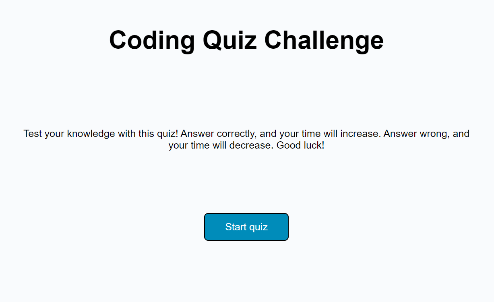

# Coding Quiz

## Description

Test your Javascript knowledge with this timed coding quiz! At the end of the quiz, users may save their score to gauge their progress. 

## Usage

Users may visit the webpage at [https://elliewalsch.github.io/coding-quiz/](https://elliewalsch.github.io/coding-quiz/)

Answer carefully! The timer begins at 50 seconds, wrong answers subtract 10 seconds and correct answers add 5 seconds. Users may save their high score at the end of the quiz. 

## Credits

Tutorials followed: 

 - [James Q Quick](https://www.youtube.com/watch?v=jfOv18lCMmw&ab_channel=JamesQQuick) 
 - [Button styling](https://www.w3schools.com/css/css3_buttons.asp) 

